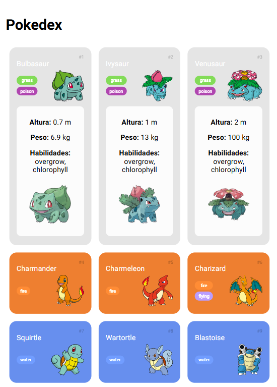

# 🌟 Pokédex Web App

Bem-vindo ao Pokédex Web App! 🌟 Este é um projeto interativo que consome a PokeAPI para listar Pokémons, exibir detalhes ao clicar e carregar mais Pokémons dinamicamente.

## ✨ Funcionalidades

- 🔄 **Listagem de Pokémons** com imagem, nome e tipos.
- 🎯 **Exibição de Detalhes** ao clicar em um Pokémon.
- ⏬ **Carregamento Dinâmico** de mais Pokémons.
- 🔗 **Consumo da API da PokeAPI**.

## 📚 Tecnologias Utilizadas

- ☕ **JavaScript** (Manipulação do DOM e consumo da API)
- 🔍 **HTML** (Estrutura da página)
- 🔦 **CSS** (Estilização e responsividade)

## 📈 Explicação do Código
💎 Arquivo main.js
- Captura elementos do DOM (document.getElementById).
- Adiciona evento de clique nos Pokémons para buscar detalhes.
- Consome a API via fetch para obter informações.
- Exibe dinamicamente os detalhes dentro do card do Pokémon.

## ✨ Demonstração
📹 

## 📢 Contato
Se tiver dúvidas ou sugestões, entre em contato:

- 👨‍💻 João Victor Ricci
- 👨‍🎓 [Linkedin](https://www.linkedin.com/in/joaoriccideveloper/)
- 👤 [GitHub](https://github.com/ricciDeveloper)
